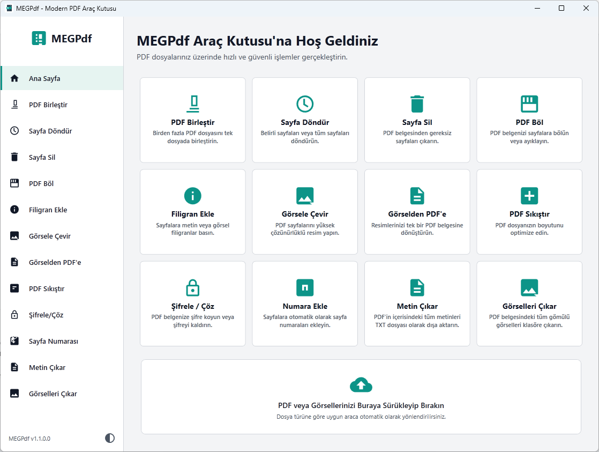

# MEGPdf - Modern PDF Araç Kutusu

[🇬🇧 English Version Below](#megpdf---modern-pdf-toolbox)

**MEGPdf**, .NET ve WPF altyapısı kullanılarak geliştirilmiş, PDF dosyalarınız üzerinde ihtiyaç duyabileceğiniz tüm temel ve gelişmiş işlemleri hızlı, güvenli ve kolay bir şekilde gerçekleştirmenizi sağlayan modern bir masaüstü uygulamasıdır. 

Şık **Açık (Light) ve Koyu (Dark) Tema** desteği, **Çoklu Dil (Türkçe ve İngilizce)** seçeneği ve kullanıcı dostu arayüzü sayesinde, karmaşık menüler arasında kaybolmadan dosyalarınızı sürükleyip bırakarak işlemlerinizi anında tamamlayabilirsiniz. Tema ve dil tercihleriniz otomatik olarak kaydedilir.



## 🚀 Özellikler

- **PDF Birleştir (Merge):** Sürükle-bırak yöntemiyle dilediğiniz sayıda PDF dosyasını tek bir belge haline getirin.
- **PDF Sıkıştır (Compress):** Büyük boyutlu dosyalarınızı optimize edin. Sıkıştırma seviyesi, sadece görselleri veya sadece metinleri sıkıştırma gibi gelişmiş ayarlarla kaliteden ödün vermeden boyutları küçültün.
- **Şifrele / Çöz (Protect & Unlock):** Belgelerinize açılış parolası koyarak yetkisiz erişimi engelleyin veya yetkiniz olan dosyaların kısıtlamalarını tamamen kaldırın.
- **Sayfa Döndür (Rotate):** PDF içerisindeki belirlediğiniz sayfaları (hepsi veya 1-3, 5 gibi) 90°, 180° veya 270° açılarla döndürün.
- **Sayfa Sil (Delete):** Belgenizde bulunmasını istemediğiniz sayfaları kolayca seçip silerek yeni belge oluşturun.
- **PDF Böl / Ayıkla (Split):** PDF dosyanızı belirli sayfalara göre ayırın veya tüm sayfaları ayrı ayrı bağımsız PDF'ler olarak klasöre çıkartın.
- **Sayfa Numarası Ekle (Add Page Numbers):** İster sol, ister sağ köşeye istediğiniz punto büyüklüğünde şık ve otomatik sayfa numarası ekleyin. Sisteminizdeki tüm yazı tiplerini destekler.
- **Metin Çıkar (Extract Text):** PDF'in içerisine gömülü olan tüm metinleri hızlıca tarayıp `.txt` dosyası olarak kaydedin.
- **Görselleri Çıkar (Extract Images):** PDF belgesinin içerisine gömülü olan (JPEG formatındaki) tüm görselleri saniyeler içinde tarayıp tek seferde bir klasöre çıkartın.
- **Filigran Ekle (Watermark):** Sayfaların istenilen konumuna metin veya görsel formatında şeffaf filigran (watermark) ekleyerek belgelerinizi markalayın. Canlı önizleme (yakınlaştırma destekli), özel renk paleti ve yazı tipi seçimi ile tam kontrol sağlar.
- **Görsele Çevir (PDF to Image):** PDF sayfalarınızı yüksek çözünürlüklü görseller (PNG, JPG vb.) olarak tek tuşla dışa aktarın.
- **Görselden PDF'e (Image to PDF):** Elinizdeki fotoğrafları ve görselleri tek bir PDF belgesi içerisinde derleyin.

## 🛠️ Kullanılan Teknolojiler
* **C# / .NET 10.0:** Yüksek performanslı ve güncel altyapı.
* **WPF (Windows Presentation Foundation):** Modern, akıcı ve duyarlı kullanıcı arayüzü.
* **PdfSharp & Docnet.Core:** Güçlü, esnek ve hızlı PDF işleme yetenekleri.

## 📥 Kurulum & Kullanım

1. Repoyu bilgisayarınıza klonlayın:
   ```bash
   git clone https://github.com/muratgul/PdfTool.git
   ```
2. Projeyi Visual Studio veya Rider ile açın (Ya da komut satırında `dotnet build` komutunu çalıştırın).
3. Uygulamayı başlatarak dosyalarınızı arayüze sürükleyip anında işlem yapmaya başlayın!

## 🤝 Katkıda Bulunma

Projeye katkıda bulunmak isterseniz lütfen bir `Pull Request` gönderin veya karşılaştığınız sorunlar için bir `Issue` açın. Geri bildirimleriniz ve destekleriniz için teşekkürler!

---

# MEGPdf - Modern PDF Toolbox

**MEGPdf** is a modern desktop application built on .NET and WPF, designed to let you perform all basic and advanced operations on your PDF files quickly, securely, and easily.

With its sleek **Light and Dark Theme** support, **Multi-language (Turkish & English)** options, and user-friendly interface, you can instantly complete your tasks by dragging and dropping files without getting lost in complex menus. Your theme and language preferences are saved automatically.


## 🚀 Features

- **Merge PDF:** Combine any number of PDF files into a single document using drag-and-drop.
- **Compress PDF:** Optimize your large files. Reduce file sizes without compromising quality using advanced settings like compression level, image-only, or text-only compression.
- **Protect & Unlock:** Prevent unauthorized access by adding an open password to your documents, or completely remove restrictions from files you are authorized to access.
- **Rotate Page:** Rotate specific pages (all, or 1-3, 5 etc.) in your PDF by 90°, 180°, or 270°.
- **Delete Page:** Easily select and delete pages you don't want in your document to create a new one.
- **Split PDF:** Split your PDF file by specific pages or extract all pages as separate, independent PDFs into a folder.
- **Add Page Numbers:** Add stylish and automatic page numbers to the left or right corners in any font size. Supports all installed system fonts.
- **Extract Text:** Quickly scan and save all embedded text in the PDF as a `.txt` file.
- **Extract Images:** Scan and extract all embedded images (in JPEG format) within the PDF document to a folder in seconds.
- **Watermark:** Brand your documents by adding a transparent watermark in text or image format to the desired position. Includes live preview with zooming, custom color picker, and font selection for complete control.
- **PDF to Image:** Export your PDF pages as high-resolution images (PNG, JPG, etc.) with a single click.
- **Image to PDF:** Compile your photos and images into a single PDF document.

## 🛠️ Technologies Used
* **C# / .NET 10.0:** High performance and modern infrastructure.
* **WPF (Windows Presentation Foundation):** Modern, fluid, and responsive user interface.
* **PdfSharp & Docnet.Core:** Powerful, flexible, and fast PDF processing capabilities.

## 📥 Installation & Usage

1. Clone the repository to your computer:
   ```bash
   git clone https://github.com/muratgul/PdfTool.git
   ```
2. Open the project with Visual Studio or Rider (Or run the `dotnet build` command in your terminal).
3. Start the application, drag your files into the interface, and start processing instantly!

## 🤝 Contributing

If you want to contribute to the project, please submit a `Pull Request` or open an `Issue` for any problems you encounter. Thank you for your feedback and support!

---

*MEGPdf is designed to accelerate your PDF workflow.*
